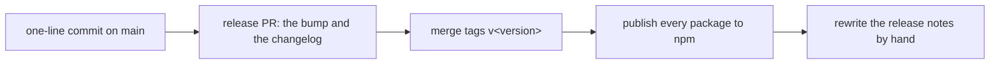

How this repository works, and what a change touches. Every piece is a package of its own, and the harness brings them all.

## Setup

Requires [Bun](https://bun.sh). `bun install` links the workspace packages and installs the Lefthook hooks.

```bash
bun run check      # tsc --noEmit over every package
bun run lint       # oxlint
bun run fmt        # oxfmt (writes)
bun run test       # bun test
bun run verify     # all of the above, the docs check and the pi defaults
bun run docs       # redraw the pictures in the docs from the code
```

Lefthook formats and lints staged files on commit, type-checks the repository, and runs the full verify before a push. The perf check (see [Tests](#tests)) runs on a commit too, and only then.

## The shape

```text
packages/
  ask-permission/   # @adeildo/pi-ask-permission: the permission dialog and the judge
  look/             # @adeildo/pi-look: start card, framed editor, boxes around calls, footer
  providers/        # @adeildo/pi-providers: Claude plan billing and accounts
  ask-questions/    # @adeildo/pi-ask-questions: the ask_questions tool and its dialog
  harness/          # @adeildo/pi-harness: every piece above, one extension each
  kit/              # @adeildo/pi-kit: app builder, feature scope, settings, events
```

Tooling lives at the root: one `tsconfig.json`, one oxlint and oxfmt config, one lockfile. The pi SDK versions are pinned in the root `package.json`, and the Newest pi workflow bumps them when verify passes against a new release. Packages declare the pi SDK as `peerDependencies` with `"*"`, and internal dependencies use `workspace:*`.

A piece is a folder under `packages/` whose `src/index.ts` exports its feature and a default extension that mounts it. To add one, the harness needs a dependency on it and a file in `packages/harness/src/` that mounts the same feature object, listed in its `pi.extensions`. Publishing goes through `bun pm pack`, which writes the real version into the tarball, and `bun run smoke` fails when a `workspace:` range survives it.

## Writing a feature

Build it with `defineFeature` and `createApp` from `@adeildo/pi-kit`. The harness mounts the same feature object as the standalone package, so a feature written this way works in both places without changes, and the kit keeps it from running twice when both are installed. The [kit README](packages/kit/README.md) has the API. The rules:

- `setup` only registers. Anything that lasts starts in `scope.onSessionStart` and stops in `scope.onShutdown`.
- The scope is the extension API plus the app's services, and `scope.on` and `scope.registerCommand` come with the feature's name on every error.
- Declare a setting next to the feature that reads it. Only settings that are safe to take from a cloned repository get `project: true`.
- A feature never imports another feature's state. Anything that crosses features is an event in `packages/kit/src/contracts/`, with a plain JSON payload.
- Every rule of the feature gets a test that fails when the rule breaks. `@adeildo/pi-kit/testing` fakes pi for that.

## Tests

```bash
bun test                      # everything
bun test ./packages/look      # one package
bun run perf                  # the redraw guard on its own
```

`@adeildo/pi-kit/testing` fakes pi, a scope and a context, and two fakes on one event bus behave like two extensions in the same process. A test file for a package, a feature or a single rule is the unit here: the rule is what the test names, and the failing case matters more than the happy one.

`packages/look/test/perf.test.ts` counts the colour calls of a component that is drawn again without changing, and fails when it is painted twice. That is what keeps typing cheap: a redraw that changes nothing must not cost the terminal anything. It runs in `verify` (so, in CI and on a push) and as the `perf` step of a commit.

## The pictures in the docs

The pictures in the READMEs are drawn by the code, from the scenes in `scripts/docs/scenes.ts`, with pi's `dark` theme. A page shows one with an empty block, and `bun run docs` fills it:

```md
<!-- docs:ask-permission/preview -->
<!-- /docs -->
```

```bash
bun run docs         # draw the pictures that changed and fill the blocks; needs rsvg-convert and a JetBrains Mono Nerd Font
bun run docs:check   # fail when one is out of date; verify and CI run it, with no renderer
```

Each PNG carries the hash of the SVG it was drawn from, so the check reads the hash instead of drawing, and a run that changes nothing draws nothing. A scene named `pkg/file` draws `packages/pkg/assets/file.png`, and a scene can be shown by several pages.

Two things need a hand: a page that wants two pictures side by side writes its own `<p align="center">` with the two images, since markdown puts one picture per block, and a page that wants a caption the scene does not carry writes it there too. The pictures still come from the scenes.

## Releases

Commits follow [Conventional Commits](https://www.conventionalcommits.org), scoped by feature (`feat(look): ...`, `fix(ask-permission): ...`). A dependency bump is typed `deps` rather than `chore(deps)`, because the changelog groups by type and a bump that changes which pi version is needed has to be readable from it.



Every package ships at one version, the way pi does. [release-please](https://github.com/googleapis/release-please) has one component, the repository root: `.release-please-manifest.json` holds the version and `extra-files` in `release-please-config.json` writes it into each package's `package.json`. Auth is [trusted publishing](https://docs.npmjs.com/trusted-publishers/) over OIDC, so no `NPM_TOKEN` secret exists.

```bash
bun run smoke        # pack every package, install it outside the repo, load it
bun run publish:dry  # what a publish would do, without publishing
bun run trust        # point npm's trusted publisher at release.yml, per package
```

A trusted publisher can only be added to a package that already exists, so a new one goes out by hand first:

1. Set its `version` to the repository's and add its `package.json` to `extra-files` in `release-please-config.json`.
2. `bun run publish`, which publishes what is missing and asks for 2FA.
3. `bun run trust --only <package>`.

`changelog-sections` in `release-please-config.json` decides what the release notes show: features, fixes, performance, reverts and dependencies. Everything else, refactors, docs and tests among them, stays in the git log. The entries themselves are rewritten by hand after the merge, because the bot groups commits and repeats their subjects, which reads like a commit log. Say what the release adds and what it asks of the user. It has to happen after the merge, since release-please rebuilds the pending section on every push to `main`. Two things the bot never knows belong in that pass: a package that is new to the release, and a new requirement, like the pi version a release needs.

### When pi ships

The Newest pi workflow runs `verify` against the newest pi SDK once a day, and on every push. When it passes it opens the bump PR, and when it fails it files an issue. Two checks belong to a pi release and are not in the package code:

- **The API.** A changed API breaks the types or the tests, and the workflow reports it with a log.
- **The defaults.** `packages/harness/src/setup.ts` lists every pi setting the harness changes, with the default it was chosen against. `bun run pi:defaults` fails when pi moves one of them, so an override that stopped mattering is retired instead of lingering.

Every pi release also gets a line under "Pi releases" in [ROADMAP.md](ROADMAP.md), saying what it changed in the plan. That is written by hand, with the bump.

## Credit

The pieces borrow from other people's work, and the READMEs of each piece name where. In one line: [pi-open-tui](https://github.com/OldSuns/pi-open-tui) and [oh-my-pi](https://github.com/can1357/oh-my-pi) for the screen, [rpiv-ask-user-question](https://github.com/juicesharp/rpiv-mono/tree/main/packages/rpiv-ask-user-question) for the questions, [pi-claude-max](https://github.com/bradennss/pi-claude-max) for the Claude plan billing, and [pi-multiprovider](https://github.com/monotykamary/pi-multiprovider) for pooling accounts of one provider.
