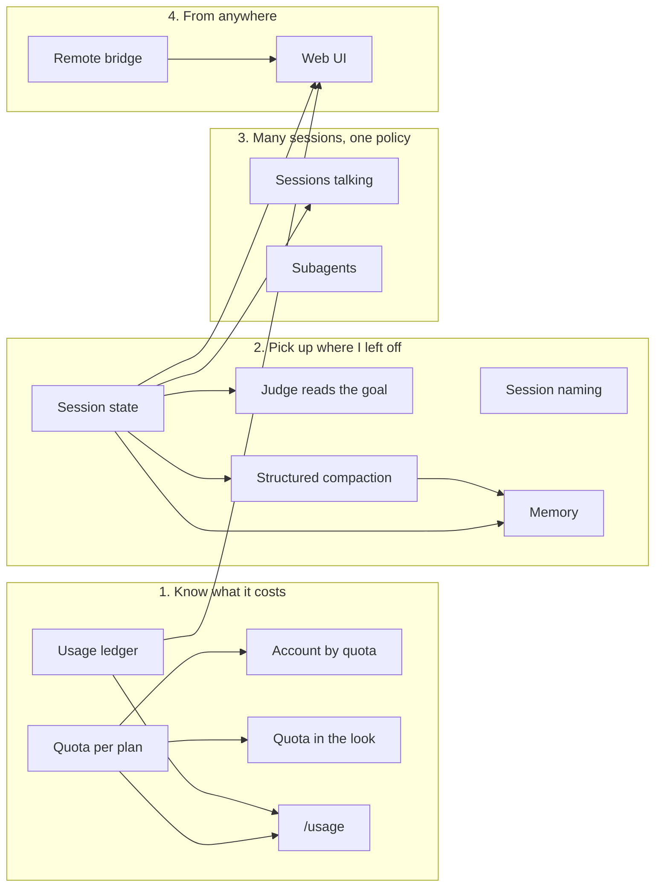

# Roadmap

## Where this is going

The agent writes faster than I read, and that will not change soon. So the work is not to take me out of the loop. It is to make my decision arrive in time, and to spend less of my attention on each call.

The destination is one install where several agents work at once and I stay the one who decides. Every call that matters reaches me with what I need to judge it. Every session says what it is doing, what it costs and what it decided, in a form the next session can read. And I can answer from my phone, under the same policy.

An item earns its place by saving something I do ten times a day, and it says how much. If the reason is that it is more elegant, it goes.

## Rules for every item

- Pi first. Before an item starts, check that pi does not ship it. Every pi release gets a pass over this file, logged at the end.
- Pi stays Pi. No fork, and `pi remove` puts it back.
- Every feature is built on `@adeildo/pi-kit`, and features only talk through the contracts in `packages/kit/src/contracts/`. The payloads are plain JSON, so a bridge can forward them without knowing what they mean.
- Anything that decides for me is visible and can be undone.
- Nothing leaves the machine unless I ask. That covers usage, traces and memory.

## Where it stands

- **Permission.** A dialog before a tool call runs, with yes, always yes or no and a note the model reads. A judge on one of pi's classifier models answers the routine calls, and reads my last message as context. MCP servers get a policy each, and every call inside a codemode script is decided on its own.
- **Questions.** The model asks instead of guessing, with options, a preview of each and a note on any of them. The answer is stored with the call. The permission ask goes through the same dialog.
- **Look.** A start card, a framed editor with slots in its borders, a strip with the last call's wait and speed, and a footer with cost, tokens and cache.
- **Providers.** Anthropic billed to the Claude plan, several accounts per provider, and a switch to the next account when a limit hits.
- **Kit.** Settings on `Alt+S`, and the contracts the features talk through.

## The map

What each item waits on. An arrow goes from what has to land first.

The milestones run in order, and the small things at the end fit between any two.

## 1. Know what it costs

On a subscription the footer's dollars are what the tokens would have cost, not what is left of the plan. What is left lives in each provider's own API, and what I spent across sessions lives in the session files. The footer shows neither.

| Item              | Needs          | Notes                                                                                                                                                     |
| ----------------- | -------------- | --------------------------------------------------------------------------------------------------------------------------------------------------------- |
| Quota per plan    |                | What is left and when it resets, read from the endpoints below. A feature of its own, because three items read it                                         |
| Account by quota  | Quota per plan | The switch on limit moves to the account with the most left, instead of the next in the list                                                              |
| Quota in the look | Quota per plan | A footer segment, in percent and reset time                                                                                                               |
| Usage ledger      |                | One record per session, project, account and model, built from `~/.pi/agent/sessions` with a cache. Time worked is a heuristic                            |
| `/usage`          | Quota, ledger  | One screen with what the plan says is left next to what I spent, per account. Dollars where the provider bills per token, percent where it bills per plan |

The quota endpoints are not official, and each needs the token pi already stores.

| Provider   | Endpoint                                                                     | Gives                                 |
| ---------- | ---------------------------------------------------------------------------- | ------------------------------------- |
| Anthropic  | `api.anthropic.com/api/oauth/usage`, with `anthropic-beta: oauth-2025-04-20` | 5-hour and weekly windows, and resets |
| OpenAI     | `chatgpt.com/backend-api/wham/usage`, with `ChatGPT-Account-Id`              | Windows with percent used             |
| Copilot    | `api.github.com/copilot_internal/user`                                       | Percent left, allowance, reset, plan  |
| OpenRouter | `openrouter.ai/api/v1/key`                                                   | Credit used, limit and what is left   |

Sign in with ChatGPT lives on the `openai` provider now, and `openai-codex` is legacy, so the OpenAI quota reads whichever one holds the token. A third-party tool on a Claude plan spends extra usage billed per token, not the plan's windows, so the Anthropic windows show what Claude Code used.

Open:

- Is the 5-hour window rolling, or a block that starts at the first request?
- How long a gap counts as a pause when the ledger measures time worked? Fifteen minutes is the guess.

## 2. Pick up where I left off

Resuming a session means rereading it. Compaction writes a summary in prose. The judge reads my last message as the intent, and that message is often just "continue".

| Item                  | Needs                     | Notes                                                                                                                                              |
| --------------------- | ------------------------- | -------------------------------------------------------------------------------------------------------------------------------------------------- |
| Session naming        |                           | A name from the first turns. The look already shows it                                                                                             |
| Session state         |                           | Goal, current task, plan, touched files and the last summary. A snapshot per session, never an event log                                           |
| Judge reads the goal  | Session state             | The goal replaces the last message as the judge's intent. The judge itself does not change                                                         |
| Structured compaction | Session state             | Goal, decisions, open questions and files, from the session state instead of prose                                                                 |
| Memory                | Session state, compaction | Replaces `pi-memory`. Markdown is the source of truth, and a command reviews and deletes what was stored. Nothing is recorded without me seeing it |

Open:

- One memory file with sections, or a global one and one per project?

## 3. Many sessions, one policy

Two agents in one repository cannot see each other, and a child agent's calls should reach the same permission as its parent's.

| Item             | Needs         | Notes                                                                                                                |
| ---------------- | ------------- | -------------------------------------------------------------------------------------------------------------------- |
| Sessions talking | Session state | An inbox folder per session with one file per message, and `pi.events` inside one process. Nobody waits on anybody   |
| Subagents        |               | Replaces `pi-subagents`. Children over `RpcClient`, with their permission dialogs forwarded to the parent            |
| The routed model | A router      | With a virtual model, the look shows the model that answered instead of `auto`. Nothing I run registers a router yet |

## 4. From anywhere

| Item          | Needs                         | Notes                                                                                                                                                    |
| ------------- | ----------------------------- | -------------------------------------------------------------------------------------------------------------------------------------------------------- |
| Remote bridge |                               | Forwards the kit's contracts and pi's RPC dialogs over a socket reachable through Tailscale. Approve a call from the phone. It never runs in `full` mode |
| Web UI        | Bridge, session state, ledger | Sessions, their state, the approvals waiting, and usage                                                                                                  |
| Voice         |                               | Local whisper, with the text pasted into the editor                                                                                                      |

## Small things

None of these waits on anything.

- **`/harness setup`.** Applies the pi settings listed in `packages/harness/src/setup.ts`, which a package cannot set by itself. `bun run pi:defaults` already fails when pi moves a default one of them was chosen against.
- **`ctrl+g` in a typed answer.** Opens the external editor, the last piece of the question tool's port.
- **The desktop theme goes.** Pi's `system` theme builds from the terminal's palette. `look/src/desktop/`, the `look.desktop*` settings and `/look theme` leave after one test with it.
- **A release preflight.** Refuses to release when `main` is behind, the tree is dirty, or CI is red for the commit.
- **A local release dry run.** Installs the packed tarballs outside the repository and runs a real `pi` session against them.

## Later

Each waits on a need I can name.

- **Web search by kind of question.** Docs, code or news. `pi-web-access` stays until one of its limits costs me something.
- **GitHub, Linear and CI.** CI as a watcher that emits events, and a policy per repository.
- **QA in a browser.** Reuse a session I already signed into, and never see a password. Open: attach to my Chromium over CDP, or give the agent a profile I sign into once.
- **Mentions.** `#entry`, `@file` and session references expanded before the turn.
- **Compaction by classifier.** A classifier picks which entries stay, in place of a summary. Needs structured compaction first.

## Waiting on pi

- **Hiding a provider from `/model`.** `enabledModels` covers startup and cycling only, and a command cannot shadow a built-in. `pi-hide-providers` stays until pi has a catalog hook.

## Parked

- A policy that learns from my denials. It needs a decision log and months of it, and it would only ever suggest.
- Review with anchored annotations. It needs the session state.
- A sandbox that decides where a command runs. Whether it may run is the permission's question, where it runs is another.

## Out

- Semantic PR review, which is a product of its own.
- A fork of pi, a plugin store, vector search in the first memory, a policy that changes by itself.
- Translations. English only.

## Pi releases

What each pi release changed in this plan.

- **1.0.1 (2026-10-03).** Extensions call classifiers through `ctx.modelRegistry.classify()`, and Cloudflare's Clef joins Jev. The judge runs on them, and its own TypeSafe client and the chat model path came out. `.pi/mcp.json` can switch a user's MCP server for one project, which the MCP policy reads as any other server.
- **1.0.0 (2026-10-01).** Fullscreen is the default `tuiMode`.
- **0.99.2 (2026-09-30).** `/reload` turns on tools newly added to `defaultTools`, so `/harness setup` can add a tool without a restart.
- **0.99.1 (2026-09-29).** Nothing for this plan.
- **0.99.0 (2026-09-29).** MCP is built in, with codemode, `tool_search` and `/mcp`, so the MCP item became the permission for MCP calls. The `system` theme is the default, so the desktop theme goes. Virtual models route requests, so the model per task is a router and not code of mine. Sign in with ChatGPT moved to `openai`, and the quota follows the token. `pi config` filters every package's extensions, which took the feature switches off `/harness setup`.
