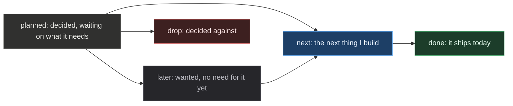
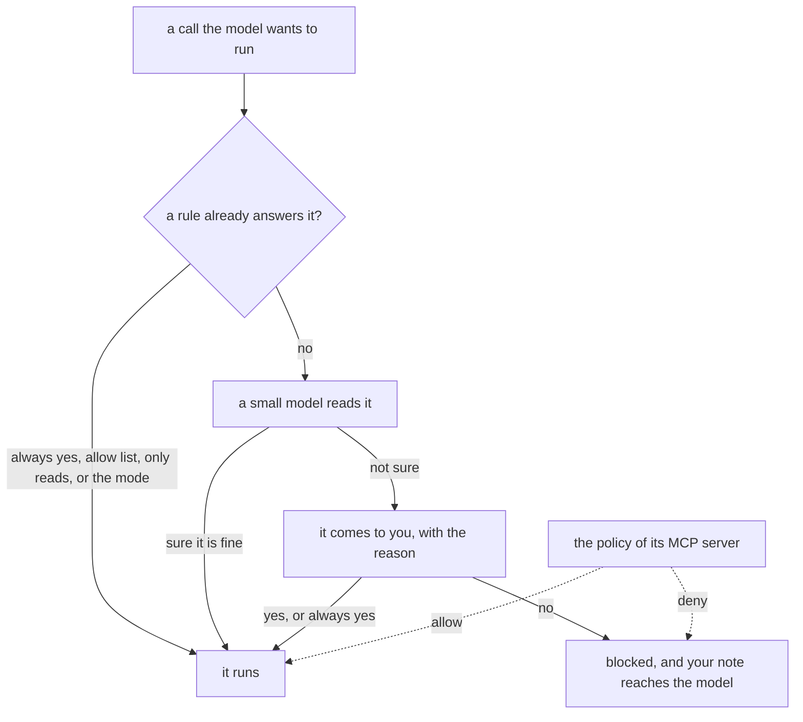

# Roadmap

## Where this is going

The agent writes faster than I read, and that will not change soon. So the work is not to take me out of the loop. It is to make my decision arrive in time, with less of my attention spent per call.

The destination is one install where several agents work at once and I stay the one who decides. Every call that matters reaches me with what I need to judge it, on the call itself. Every session says what it is doing, what it costs and what it decided, in a form the next session can read. And I can answer from my phone, under the same policy.

An item earns its place by saving something I do ten times a day, and it says how much. If the reason is that it is more elegant, it goes.

## Rules for every item

- Pi first. Before an item starts, check that pi does not ship it. Every pi release gets a pass over this file, logged at the end.
- Pi stays Pi. No fork, and `pi remove` puts it back.
- Every feature is built on `@adeildo/pi-kit`, and features only talk through the contracts in `packages/kit/src/contracts/`. The payloads are plain JSON, so a bridge can forward them without knowing what they mean.
- Anything that decides for me is visible and can be undone.
- Nothing leaves the machine unless I ask. That covers usage, traces and memory.

An item moves from `planned` to `next` to `done`, and leaves by `drop`. The notes stay short on purpose: `CHANGELOG.md` has the detail of what shipped.

This is how a call is decided today. Everything in the picture ships.

## Permission. `@adeildo/pi-ask-permission`

| Item                        | Status  | Note                                                                                                             |
| --------------------------- | ------- | ---------------------------------------------------------------------------------------------------------------- |
| The dialog                  | done    | yes, always yes or no, with a note the model reads, on a command longer than three lines shows how many are left |
| Grants at three scopes      | done    | session, project and everywhere, forgotten from the settings screen                                              |
| Modes                       | done    | manual, edits, judge and full, with `Alt+W` for a call outside the workspace                                     |
| MCP policies and codemode   | done    | a call follows the policy of its server, and every call inside a script is decided on its own                    |
| The judge on pi's models    | done    | `ctx.modelRegistry.classify()`, so there is no provider of ours and no prompt of ours to keep                    |
| Every call says who decided | done    | the reason sits on the call, and the calls of one answer are judged together                                     |
| Judge reads the goal        | planned | The goal replaces my last message as what the judge knows about the work. Needs the session state                |

## Questions. `@adeildo/pi-ask-questions`

| Item                       | Status  | Note                                                                           |
| -------------------------- | ------- | ------------------------------------------------------------------------------ |
| The tool and its dialog    | done    | options, a preview of each, a note on any of them, and a row for my own answer |
| One dialog for both        | done    | the permission ask goes through it, so both take the same keys                 |
| `ctrl+g` in a typed answer | planned | opens the external editor, the last piece of the port                          |

## Accounts. `@adeildo/pi-providers`

| Item              | Status  | Note                                                                                                              |
| ----------------- | ------- | ----------------------------------------------------------------------------------------------------------------- |
| Subscription      | done    | an Anthropic OAuth request is billed to the Claude plan, and an API key goes out untouched                        |
| Several accounts  | done    | the pi login is the first one, another comes from the provider's own login, and `Alt+A` cycles them               |
| Switch on limit   | done    | an account that hits a limit hands over to the next one, asking first by default                                  |
| Quota per plan    | next    | what is left and when it resets, read from the endpoints below. A feature of its own, because three items read it |
| Account by quota  | planned | the switch moves to the account with the most left, instead of the next in the list. Needs the quota              |
| Quota on the look | planned | a segment in the footer, in percent and reset time. Needs the quota                                               |

The quota endpoints are not official, and each needs the token pi already stores.

| Provider   | Endpoint                                                                     | Gives                                 |
| ---------- | ---------------------------------------------------------------------------- | ------------------------------------- |
| Anthropic  | `api.anthropic.com/api/oauth/usage`, with `anthropic-beta: oauth-2025-04-20` | 5-hour and weekly windows, and resets |
| OpenAI     | `chatgpt.com/backend-api/wham/usage`, with `ChatGPT-Account-Id`              | Windows with percent used             |
| Copilot    | `api.github.com/copilot_internal/user`                                       | Percent left, allowance, reset, plan  |
| OpenRouter | `openrouter.ai/api/v1/key`                                                   | Credit used, limit and what is left   |

Sign in with ChatGPT lives on the `openai` provider now, and `openai-codex` is legacy, so the OpenAI quota reads whichever one holds the token. A third-party tool on a Claude plan spends extra usage billed per token, not the plan's windows, so the Anthropic windows show what Claude Code used.

Open:

- Is the 5-hour window rolling, or a block that starts at the first request?

## What I see. `@adeildo/pi-look`

| Item                     | Status | Note                                                                                                                                               |
| ------------------------ | ------ | -------------------------------------------------------------------------------------------------------------------------------------------------- |
| The start card           | done   | the model with its effort, the folder and the tree, the machine, what loaded, and the keys worth knowing                                           |
| The framed editor        | done   | the branch, the folder, the permission mode, the model and the context in its borders                                                              |
| The strip and the footer | done   | the stopwatch, the last call's wait and speed, then the cost, the tokens, the cache and the average speeds                                         |
| A box around each call   | done   | the icon, the name, the reason it ran, a cut before the output, and the time on the bottom line                                                    |
| The desktop theme goes   | drop   | pi's `system` theme builds from the terminal's palette now, so `look/src/desktop/`, `look.desktop*` and `/look theme` leave after one test with it |

Open:

- Some of the pi settings the harness sets are already pi's defaults now. `bun run pi:defaults` checks that on every run, and `packages/harness/src/setup.ts` holds the list.

## Usage

| Item         | Status  | Needs         | Note                                                                                                                                                      |
| ------------ | ------- | ------------- | --------------------------------------------------------------------------------------------------------------------------------------------------------- |
| Usage ledger | planned |               | One record per session, project, account and model, built from `~/.pi/agent/sessions` with a cache. Time worked is a heuristic                            |
| `/usage`     | planned | Quota, ledger | One screen with what the plan says is left next to what I spent, per account. Dollars where the provider bills per token, percent where it bills per plan |

Open:

- How long a gap counts as a pause when the ledger measures time worked? Fifteen minutes is the guess.

## Sessions

| Item                     | Status  | Needs                     | Note                                                                                                     |
| ------------------------ | ------- | ------------------------- | -------------------------------------------------------------------------------------------------------- |
| Session naming           | planned |                           | A name from the first turns. The look already shows it                                                   |
| Session state            | planned |                           | Goal, current task, plan, touched files and the last summary. A snapshot per session, never an event log |
| Structured compaction    | planned | Session state             | Goal, decisions, open questions and files, from the session state instead of prose                       |
| Memory                   | planned | Session state, compaction | Replaces `pi-memory`. Markdown is the source of truth, and a command reviews and deletes what was stored |
| Compaction by classifier | later   | Structured compaction     | A classifier picks which entries stay, in place of a summary                                             |
| Mentions                 | later   |                           | `#entry`, `@file` and session references expanded before the turn                                        |

Open:

- One memory file with sections, or a global one and one per project?

## Many sessions, one policy

| Item             | Status  | Needs         | Note                                                                                                      |
| ---------------- | ------- | ------------- | --------------------------------------------------------------------------------------------------------- |
| Sessions talking | planned | Session state | An inbox folder per session with one file per message, and `pi.events` inside one process. Nobody waits   |
| Subagents        | later   |               | Replaces `pi-subagents`. Children over `RpcClient`, with their permission dialogs forwarded to the parent |
| The routed model | later   | A router      | With a virtual model, the look shows the model that answered instead of `auto`                            |

## The outside world

| Item                  | Status | Replaces        | Note                                                                                                                  |
| --------------------- | ------ | --------------- | --------------------------------------------------------------------------------------------------------------------- |
| Web search and fetch  | later  | `pi-web-access` | Route by kind of question: docs, code or news                                                                         |
| GitHub, Linear and CI | later  |                 | CI as a watcher that emits events, and a policy per repository                                                        |
| QA in a browser       | later  |                 | Reuse a session I already signed into, and never see a password. Open: attach over CDP, or a profile I sign into once |

## From anywhere

| Item          | Status | Needs                 | Note                                                                                                                      |
| ------------- | ------ | --------------------- | ------------------------------------------------------------------------------------------------------------------------- |
| Remote bridge | later  |                       | Forwards the kit's contracts and pi's RPC dialogs over a socket reachable through Tailscale. It never runs in `full` mode |
| Web UI        | later  | Bridge, state, ledger | Sessions, their state, the approvals waiting, and usage                                                                   |
| Voice         | later  |                       | Local whisper, with the text pasted into the editor                                                                       |

## Platform

| Item                    | Status  | Note                                                                                                    |
| ----------------------- | ------- | ------------------------------------------------------------------------------------------------------- |
| The pi defaults check   | done    | `bun run pi:defaults` fails when pi moves a default a harness setting was chosen against                |
| `/harness setup`        | planned | Applies the pi settings listed in `packages/harness/src/setup.ts`, which a package cannot set by itself |
| A release preflight     | planned | Refuses to release when `main` is behind, the tree is dirty, or CI is red for the commit                |
| A local release dry run | planned | Installs the packed tarballs outside the repository and runs a real `pi` session against them           |

## Waiting on pi

- **Hiding a provider from `/model`.** `enabledModels` covers startup and cycling only, and a command cannot shadow a built-in. `pi-hide-providers` stays until pi has a catalog hook.

## Parked

- A policy that learns from my denials. It needs a decision log and months of it, and it would only ever suggest.
- Review with anchored annotations. It needs the session state.
- A sandbox that decides where a command runs. Whether it may run is the permission's question, where it runs is another.

## Out

- Semantic PR review, which is a product of its own.
- A fork of pi, a plugin store, vector search in the first memory, a policy that changes by itself.
- Translations. English only.

## Pi releases

What each pi release changed in this plan.

- **1.0.1 (2026-10-03).** Extensions call classifiers through `ctx.modelRegistry.classify()`, and Cloudflare's Clef joins Jev. The judge runs on them, and its own TypeSafe client and the chat model path came out. `.pi/mcp.json` can switch a user's MCP server for one project, which the MCP policy reads as any other server.
- **1.0.0 (2026-10-01).** Fullscreen is the default `tuiMode`.
- **0.99.2 (2026-09-30).** `/reload` turns on tools newly added to `defaultTools`, so `/harness setup` can add a tool without a restart.
- **0.99.1 (2026-09-29).** Nothing for this plan.
- **0.99.0 (2026-09-29).** MCP is built in, with codemode, `tool_search` and `/mcp`, so the MCP item became the permission for MCP calls. The `system` theme is the default, so the desktop theme goes. Virtual models route requests, so the model per task is a router and not code of mine. Sign in with ChatGPT moved to `openai`, and the quota follows the token. `pi config` filters every package's extensions, which took the feature switches off `/harness setup`.
